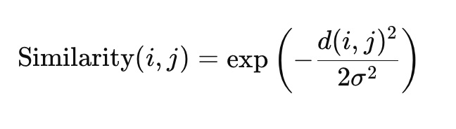
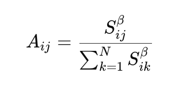
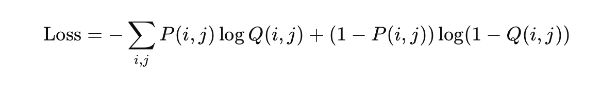
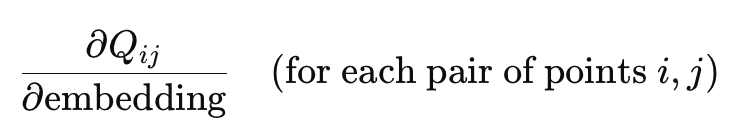
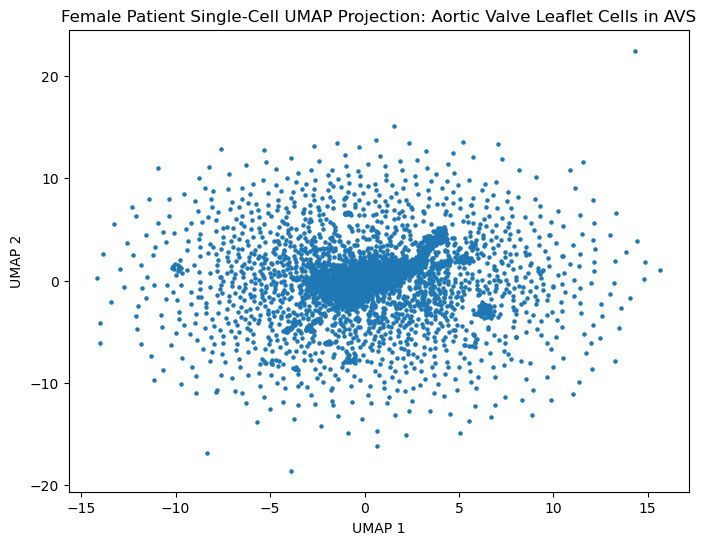
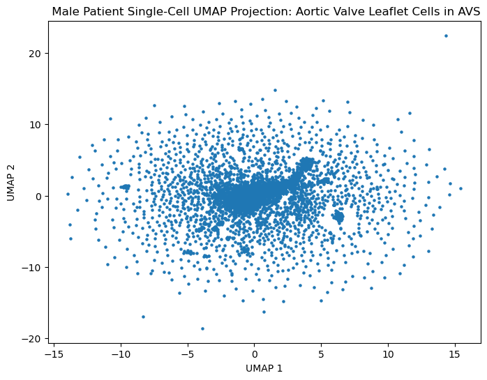
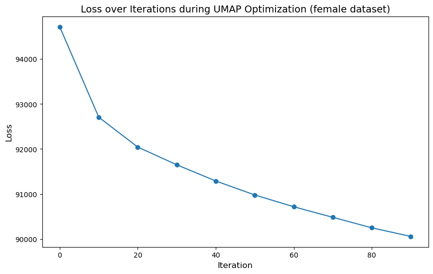
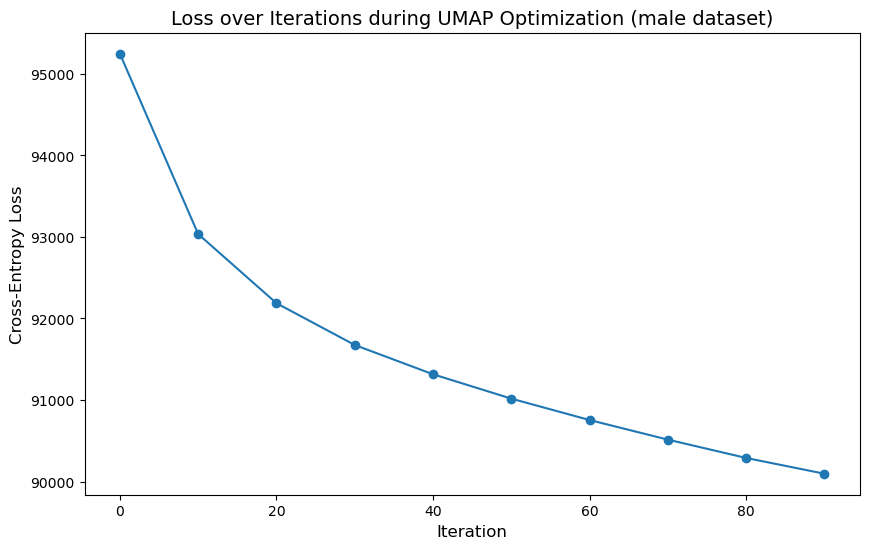
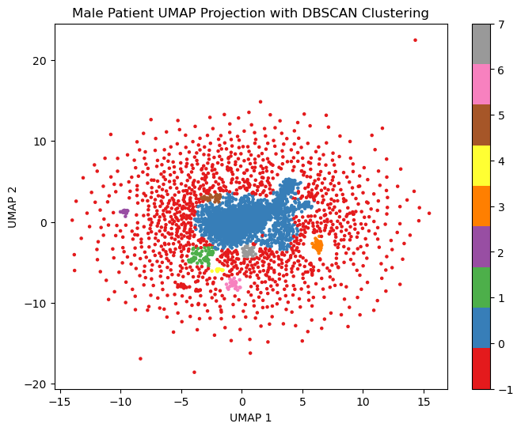
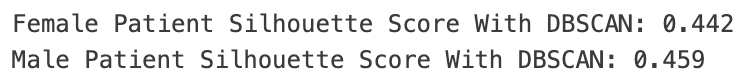

# UMAP Implementation on Single-Cell RNA Sequencing Data
This is a simplified implementation of UMAP (Uniform Manifold Approximation and Projection), programmed from scratch and applied to GEO scRNA-seq data. A project assignment for BINF6250 (Algorithmic Foundations in Bioinformatics) course at the Roux Institute at Northeastern University. You can view the entire run in the `implementation.ipynb` notebook.

## Table Of Contents
* [Summary](#summary)
* [Data Acquisition](#data-acquisition)
* [Coding the Algorithm](#the-algorithm)
* [Results and Reflection](#results)
* [References](#references)

## Summary
I would first like to emphasize that this project was not done to create an efficient or modularized algorithm ready for widespread use. Rather, it was more of a proof of concept, and a way to better learn about the intricacies of UMAP by creating a python algorithm from scratch without sklearn or scipy. I personally find single-cell RNA sequencing data very interesting, and UMAP is one of the best ways to capture local and global structures in those datasets. It is also fairly new and used widely in industry today.

The biggest issue with this implementation was the runtime and computational efficiency (creating the embeddings ended up being 32+ hours for 100 iterations). Normally, I would have the UMAP algorithm run about 500 iterations in the optimization step by default (I was trying to emulate what I knew about `umap-learn` defaults). However, this implementation was taking much too long to run on the datasets (which were scRNAseq datasets from GEO). This was even the case when I lowered `n_iterations` to only 100 (ideally, I would have liked to set it higher to reach convergence). Alternative options to fix the long runtimes might be to simplify the datasets (gene expression files are always large and complex), make the functions more efficient, run batches, find a new/simpler dataset to run, or just run UMAP the normal way with a standard library and tools such as umap-learn/scanpy. Another thing I would want to do if I had more time would be to try PCA on the dataset beforehand for noise reduction and computational efficiency. I would also try running it through a scaler (such as sklearn's StandardScaler) to help improve the convergence with gradient descent. The scaler would ensure that distance-based methods worked more effectively.

It should be noted that for ease of use, I chose to let the implementation run separately in the background, and then saved the final embeddings as separate files so that I could use them for visualization without having to rerun everything. Despite long runtimes and inefficiency, this entire process really taught me a lot about the in-depth workings and mathematics behind UMAP. The next time I use this algorithm I feel that I'll be more confident about tuning hyperparameters to best suit the needs of my dataset!

## Data Acquisition
To download the data locally, enter the following command in your terminal:
```
make data
```
Similarly, to clean out the data, enter the following command in your terminal:
```
make clean
```

The data that supports any possible findings in this project have been deposited in GEO with the accession code [GSE273980](https://www.ncbi.nlm.nih.gov/geo/query/acc.cgi?acc=GSE273980) (recently made public December 1st, 2024). These are single cell gene expression profiles of cells isolated from human aortic valve leaflets. According to the studies done in the Aguado lab at University of California San Diego, aortic valve cell heterogeneity increases during AVS (aortic valve stenosis) progression. The researches are using single cell RNA sequencing to characterize valve cell phenotypes in AVS patients. Whole cells were isolated from aortic valve leaflets of age and disease-matched AVS patients--one male and one female.
* GSM8441017_female_AVS_HH6_barcodes.tsv.gz
* GSM8441017_female_AVS_HH6_features.tsv.gz
* GSM8441017_female_AVS_HH6_matrix.mtx.gz
* GSM8441018_male_AVS_HH4_barcodes.tsv.gz
* GSM8441018_male_AVS_HH4_features.tsv.gz
* GSM8441018_male_AVS_HH4_matrix.mtx.gz

In this project, the data files shown above were refactored to create two gene expression DataFrames (barcodes/cells as rows and columns as genes)--one for the female patient, and one for the male patient. The intention was to implement my scratch UMAP algorithm on both sets and compare the final embeddings.
<p align="center">

</p> 

## The Algorithm
Before starting on the implementation, I tried to organize what I knew about UMAP into separate steps. I would then focus on creating functions for each part and then combine them in the end.

***NOTE:*** Although not recommended due to inefficiency, you can run this entire UMAP implementation (if data was downloaded in previous steps) by entering the following command in your terminal:
```
make run
```

### *1. Creating a High-Dimensional (original data) Similarity Matrix:*
* This would be done by converting high-dimensional Euclidean distances between data points (the cells) into similarities using a Gaussian kernel.
* In the `umap-learn` library, the default value for `sigma` (basically the "spread" of the Gaussian kernel) is tuned based on the data. It uses the median distance to the k-nearest neighbors (default `n_neighbors=15`) as the estimate for `sigma`. My original code was setting `sigma` to the median of the pairwise distances, meaning that I would be looking through every single point rather than just the nearest neighbors. Unfortunately, this could result in outliers influencing the value of sigma, potentially making the kernel scale too large or too small for certain points in denser areas. Because of this, I made a last minute switch to mimic `umap-learn` with sklearn's `NearestNeighbors`.
* See `high_dim_similarity_matrix.py` in the `separate_functions` directory.

<p align="center">

</p> 

### *2. Creating the Fuzzy-Simplicial Set:*
* Converting the high-dimensional similarity matrix into a probability distribution. A weighted graph where the weights represent the probability of edges between the points.
* See `fuzzy_simplicial.py` in the `separate_functions` directory.

### *3. Randomly Initializing the Embedding in a Lower-Dimensional Space (usually 2D):*
* This function would serve as the starting point for the optimization.
* See `initialize_embedding` in the `separate_functions` directory.

### *4. Creating the Low-Dimensional Similarity Matrix/Probabilities:*
* In UMAP, low-dimensional similarities are calculated using a t-distribution, which helps to maintain local structure.
* See `low_dim_similarity_matrix.py` in the `separate_functions` directory.

<p align="center">

</p> 

### *5. Optimization and Refinement:*
* In UMAP, the final embedding is optimized by minimizing the cross-entropy loss between the high-dimensional and low-dimensional similarities. It is minimizing the cross-entropy loss between high-dimensional fuzzy simplicial set and low-dimensional set, usually with stochastic gradient descent or other gradient based methods. UMAP keeps iterating these steps until convergence is reached.
* Gradient descent optimizes the low-dimensional embedding by adjusting the points to minimize the difference between high-dimensional and low-dimensional similarities. The chain rule is used to compute the gradient of the loss function with respect to the embedding, capturing how small changes in the embedding affect the pairwise similarities, and guiding the updates as such.
* See `optimization.py, run_UMAP.py, and main.py` in the `separate_functions` directory.
* To avoid rerunning the implementation (which takes an unreasonably long time on the GEO datasets), the final embeddings were saved as `.npy` files.

<p align="center">

</p> 
<p align="center">

</p> 

### *6. Visualization:*
* Additional functions to visualize results were created and can be viewed in the `separate_functions/visualization.py` file.

If you would like to generate the visualization locally, enter the following command in your terminal:
```
make visualizations
```
Doing so will generate the UMAP projections, the DBSCAN-clustered projections, and the cross-entropy optimization plots for both the Male and Female datasets. To save time, the visualization were generated from the previously saved embedding files found in `final_embeddings/`.

## Results
### *UMAP Projections for Female/Male Datasets:*
Shown below are the generated UMAP projections for both datasets based on the final low-dimension embeddings. We went from 36601 features (high-dimensional) to 2 UMAP embeddings (low-dimenional). Even without explicit clustering, the projections can show regions where the data points naturally group together, suggesting that there are inherent subgroups in the AVS data.
<p float="left", align="center">
  
   
</p>
After dimensionality reduction, the reduced data should then be ready for further adjustments, clustering (KMeans, DBSCAN, etc.) and analysis.

### *Cross-Entropy Optimization with Gradient Descent (100 iterations):*
By tracking the cross-entropy loss for every 10 iterations, we can see in the plots that the algorithm was working and loss was being minimized for the 100 iterations. That said, if runtime were not an issue, then running 500+ iterations would have been better, allowing the loss to taper off at the end and break the loop once convergence was actually met.
<p float="left", align="center">
  
   
</p>

### *Extra Visualization with Clustering:*
Normally, I would not go straight to clustering without better optimizing the UMAP projections, but the embeddings saved here are enough to see some clusters. Due to the nature of KMeans (it does not handle non-spheroid clusters very well), DBSCAN is the method I chose.
<p float="left", align="center">
  
   
</p>
<p align="center">

</p> 
The silhouette scores are moderately good, indicating that the clustering is relatively well-defined, although there is still a lot of room for refinement. This was somewhat expected, as the UMAP projection was not fully optimized due to the runtime constraints described earlier. Nevertheless, the scores demonstrate that the UMAP implementation has effectively reduced the 36,000+ features (the genes) down to just 2 UMAP dimensions, preserving enough structure to identify meaningful clusters!

## References
* GEO data acquisition [here](https://www.ncbi.nlm.nih.gov/geo/query/acc.cgi?acc=GSE273980)
* Numpy, Scikit-learn, and Scipy documentation was used throughout
* Umap-learn documentation [here](https://umap-learn.readthedocs.io/en/latest/)
* UMAP example with math formulas [here](https://towardsdatascience.com/how-to-program-umap-from-scratch-e6eff67f55fe). This also helped when creating the fuzzy-simplicial set (graph needed to be undirected) and using t-distribution.
* More on UMAP [here](https://pair-code.github.io/understanding-umap/)
* StackOverflow - normalizing a similarity matrix [here](https://stackoverflow.com/questions/8904694/how-to-normalize-a-2-dimensional-numpy-array-in-python-less-verbose)
* StackOverflow - avoiding log(0) in cross-entropy loss function [here]( https://stackoverflow.com/questions/47377222/what-is-the-problem-with-my-implementation-of-the-cross-entropy-function)

### *AI Usage (chatGPT):*
* Prompt: *How do I apply gaussian kernel to convert distances to similarities in umap by scratch?*
    * This helped me by providing the general math equation used to make the calculations.
* Prompt: *Can you give me a mathematical equation that represents cross-entropy loss (also used gradient descent, t-dist kernel, etc)?*
    * This helped provide the math equation images in this README.
* Prompt: *Can you help me find the error in my gradient descent function?*
    * I was using the chain rule incorrectly and was able to fix the issue.
* Prompt: *Why do I keep getting this same error "ValueError the truth value of an array with more than one element is ambiguous. Use a.any() or a.all()"*
    * This helped fix an error in my `cross_entropy_loss` function where I was unknowingly using a CSR sparse matrix in a boolean context. I was using `np.clip()` before converting to the dense array.